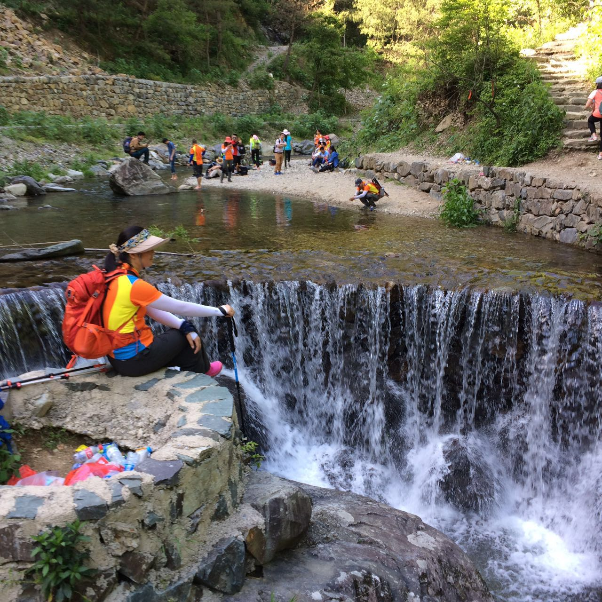

# 徽杭古道徒步

## 一、行程与地理位置简介
 徽杭古道西起安徽省宣城市绩溪县伏岭镇，东至浙江省临安市马啸乡，位于清凉峰国家级自然保护区北侧，北靠天目山，南依黄山，是古时联系徽州与杭州的重要纽带。其中保存最完整的绩溪县境内盘山石阶小道，是徽杭古道的精华所在。

徽杭古道号称是中国十大徒步线路之一(入门级)，自然风光绝佳。青山绿水野花，鸟鸣溪语风声，一路都赏心悦目。
 
 行程从绩溪入临安出，如大家所说的正穿。
 
 中午才到绩溪，乘坐小客车到古道入口，找农家吃完午饭已是下午1点半。一个人想着当天完成行程并返回杭州，故没有预订古道内的住宿，然后就开始了我的暴走加越野行程。事实证明，一天确实能完成行程，但下山后交通不便，到了傍晚，只能住在山下农家。
 路途中遇到些可以聊上一餐的朋友，一是在去绩溪的大客车上遇到同样去徒步的三个大三学生，找他们借用现金支付车费，买水，中午约在一起吃饭，席间从包里掏出两罐啤酒，反差萌得可爱；二是傍晚临时找民宿的过程中遇到的几个上海过来的四个大哥，三四十岁的好基友，和老板娘的聊天和把我当小兄弟的态度，能看出阅历十分丰富，让人感觉很豪爽。
 奇妙巧遇的还有部门同事杨哥，没有约定，同一时间却到了不同城市的同一地点，可惜近视原因没能看清，只模糊的听到有人在喊我，后面通了一通电话才知道杨哥也在那里。 

## 二、去程

#### 1.杭州汽车西站---绩溪汽车站

##### 去程大巴时刻表
 |出发时间 |  耗时  | 票价 |      备注      |
 |:-------:|:------:|:----:|:---------------|
 |  07:40  | 约3.5h |¥82.00|        较早    |
 |  08:40  | 约3.5h |¥82.00|        适中    |
 |  12:50  | 约3.5h |¥82.00|  晚上住在绩溪  |
 |  14:20  | 约3.5h |¥82.00|       不考虑   |

 网上买票，82+3(保险)，一共85元。提前在网上预订，最好是07:40那班车，07:40在杭州也不能算早，毕竟5点多天就亮了。

#### 2.绩溪---鱼川
在城南汽车站上车，绩溪到胡家的大巴，20分钟一班，票价5.5元，大约30分钟车程，在中途的鱼川下车。

#### 3.鱼川---徒步起点
 鱼川下车后穿过一个古镇，到达江南第一关徽杭古道售票处，门票68+3(保险)，一共71元。
 

## 三、穿越行程

#### 1.中途住宿
 庆华客栈：位于下雪堂与上雪堂之间（*见上图标出位置*），80元/人，包括晚餐和次日早餐。
 
 蓝天凹：三家旅社可供选择，室内8人间上下铺，室外可选择帐篷，条件没有庆华客栈好。蓝天凹是一个看日出的好地方，需要凌晨4点钟爬起来守候美丽的日出。

 由于我是想一天完成徒步行程返回杭州，没有选择古道内的住宿。由于下山后没有顺风车可搭乘，所以临时找了民宿农家乐，60/per night，住宿环境非常不错，名字叫做‘浙川农家’。P.S.找住宿的时候偶遇几个上海大哥也住他家，晚上一起吃饭，喝酒，抽烟。晚饭都是他们豪爽请客，感谢他们，有缘再见。老板娘家的饭菜都是自家菜园自家牲口宰杀的，不知道是否是徒步后太累，觉得味道非常不错。
 

## 四、返程

#### 1.徽杭古道出口---临安昌化
  交通工具：步行+公交。
  公交点位于古道出口2km处，选择步行到公交站点，乘坐公交到昌化。（听说直达昌化的公交已取消，可选择拼一个当地小面包车，25元左右）
  
  **注意：** **`末班车14：30左右`**

  我是民宿老板开车送客人（几个上海大哥）到徽杭古道入口取车，顺便送我到公交车站，然后坐公交到昌化，路程都很顺利。
 
#### 2.临安昌化汽车站---杭州汽车西站
  交通工具：汽车。
  票价：25元/人。上车投币不找零，需准备好零钱。
  时间：大概一个小时左右，具体时间记不得，一上车就睡着，到终点站才醒来，彼时已是中午时分。
  
  **注意：** **`末班车15：30左右`**
  
  
#####【温馨提示】
 0、出行记得带上足够现金，不是所有地方都支持支付宝。不然你会和我一样到处借钱的。囧...

 1、绩溪景区入口至蓝天凹为全程上坡路段，距离约11公里；蓝天凹至浙川古村为全程下坡路段，距离约4.5公里左右；路面主要为：水泥路面、碎石路、石板路，部分路段较窄，停下错开让行，注意安全；
 
 2、为预防扭伤、拉伤等情况，户外运动需要进行前期预热，因此徒步前期的30-45分钟不宜速度过快，上山路段缓步慢行，下山膝盖压力比较大，注意保护膝盖；
 
 3、为确保身体健康，准备护膝、登山杖等户外用品，使用防滑的户外登山鞋、徒步鞋；
 
 4、自备干粮或零食和矿泉水，位于蓝天凹的农家乐也有面条出售。
 
 > **此次徒步的最大意义，不是为了见多少人，看多美的风景，而是在抛开烦恼，让自己归于平静。
喜欢一个人出门，喜欢到一个没有完美规划好行程的目的地，跟着自己的思想走走停停，不会被他人影响，也不会影响到他人。**
 
 
 
