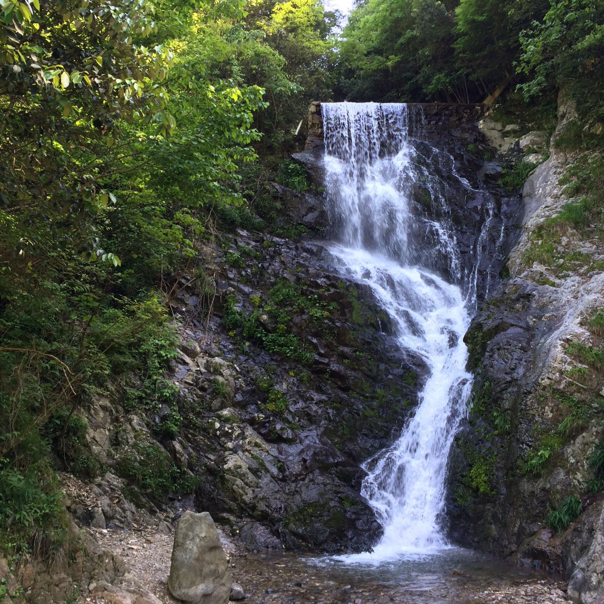

#徽杭古道徒步

##一、行程与地理位置简介
 徽杭古道西起安徽省宣城市绩溪县伏岭镇，东至浙江省临安市马啸乡，位于清凉峰国家级自然保护区北侧，北靠天目山，南依黄山，是古时联系徽州与杭州的重要纽带。其中保存最完整的绩溪县境内盘山石阶小道，是徽杭古道的精华所在。

徽杭古道号称是中国十大徒步线路之一(入门级)，自然风光绝佳。青山绿水野花，鸟鸣溪语风声，一路都赏心悦目。
 
 行程从绩溪入临安出，如大家所说的正穿。

##二、去程

####1.杭州汽车西站---绩溪汽车站

#####去程大巴时刻表
| 出发时间 |   耗时  |  票价 |      备注      |
|:-------:|:------:|:----:|:---------------|
|  07:40  | 约3.5h |¥82.00| - [ ] 较早      |
|  08:40  | 约3.5h |¥82.00| - [x] 适中      |
|  12:50  | 约3.5h |¥82.00| - [ ]晚上住在绩溪|
|  14:20  | 约3.5h |¥82.00| - [ ]不考虑     |

####2.绩溪---鱼川
在城南汽车站上车，绩溪到胡家的大巴，20分钟一班，票价5.5元，大约30分钟车程，在中途的鱼川下车。

####3.鱼川---徒步起点
 鱼川下车后穿过一个古镇，到达江南第一关徽杭古道售票处，门票68+2(保险)，一共70元。
 

##三、穿越行程

####1.中途住宿
 庆华客栈：位于下雪堂与上雪堂之间（*见上图标出位置*），80元/人，包括晚餐和次日早餐。联系方式：0563-8490803 杨先生 
 
 蓝天凹：三家旅社可供选择，室内8人间上下铺，室外可选择帐篷，条件没有庆华客栈好。
 

##四、返程

####1.徽杭古道出口---临安昌化
  交通工具：步行+公交。
  公交点位于古道出口2km处，选择步行到公交站点，乘坐公交到昌化。
  **注意：** **`末班车14：30左右`**
 
####2.临安昌化汽车站---杭州汽车西站
  交通工具：汽车。
  票价：25元/人。
  **注意：** **`末班车15：30左右`**
 
####3.杭州---上海
 交通方式：高铁/动车
 行程：1h--1.5h
 
  
  
#####【温馨提示】
1、绩溪景区入口至蓝天凹为全程上坡路段，距离约11公里；蓝天凹至浙川古村为全程上坡路段，距离约4.5公里左右；路面主要为：水泥路面、碎石路、石板路，部分路段较窄，注意安全； 
2、为预防扭伤、拉伤等情况，户外运动需要进行前期预热，因此徒步前期的30-45分钟不宜速度过快，上山路段缓步慢行； 
3、为确保身体健康，准备护膝、登山杖等户外用品，使用防滑的户外登山鞋、徒步鞋； 
4、自备干粮或零食和矿泉水，位于蓝天凹的农家乐也有面条出售。
 
 **此次徒步最大的意义，不是能见到多少人，见过多美的风景，而是走着走着，在一个际遇下，突然重新认识了自己和更深刻的你。**
 
 
 